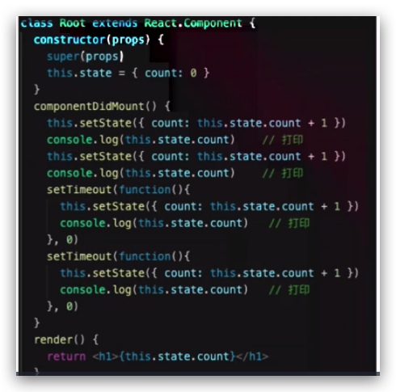
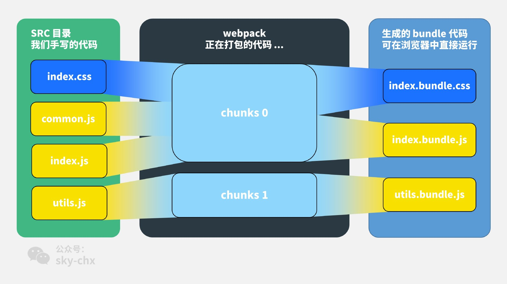

### v-show和 v-if 区别
v-if控制组件是否渲染，v-show 控制组件 css的display样式。

v-if会存在不会存在dom中，v-if会一直存在dom中。

### 为何 v-for中要有key

官方文档回答：`key` 的特殊 attribute 主要用在 Vue 的虚拟 DOM 算法，在新旧 nodes 对比时辨识 VNodes。如果不使用 key，Vue 会使用一种最大限度减少动态元素并且尽可能的尝试就地修改/复用相同类型元素的算法。而使用 key 时，它会基于 key 的变化重新排列元素顺序，并且会移除 key 不存在的元素。

有相同父元素的子元素必须有**独特的 key**。重复的 key 会造成渲染错误。

使用`id`的效率会比index的效率高，如在中间插入一条新数据，`index`会重新排序，`id`会保持不变。

此时更新渲染数据,通过`index`定义的`key`去进行前后数据的对比,发现

```
之前的数据                         之后的数据

key: 0  index: 0 name: test1     key: 0  index: 0 name: test1
key: 1  index: 1 name: test2     key: 1  index: 1 name: 我是插队的那条数据
key: 2  index: 2 name: test3     key: 2  index: 2 name: test2
                                 key: 3  index: 3 name: test3
复制代码
```

通过上面清晰的对比,发现除了第一个数据可以复用之前的之外,另外三条数据都需要重新渲染;

是不是很惊奇,我明明只是插入了一条数据,怎么三条数据都要重新渲染?而我想要的只是新增的那一条数据新渲染出来就行了

最好的办法是使用数组中不会变化的那一项作为`key`值,对应到项目中,即每条数据都有一个唯一的`id`,来标识这条数据的唯一性;使用`id`作为`key`值,我们再来对比一下向中间插入一条数据,此时会怎么去渲染

```
之前的数据                              之后的数据

key: 1  id: 1 index: 0 name: test1     key: 1  id: 1 index: 0  name: test1
key: 2  id: 2 index: 1 name: test2     key: 4  id: 4 index: 1  name: 我是插队的那条数据
key: 3  id: 3 index: 2 name: test3     key: 2  id: 2 index: 2  name: test2
                                       key: 3  id: 3 index: 3  name: test3
```

同理在react中使用map渲染列表时,也是必须加key,且推荐做法也是使用`id`,也是这个原因。

[参考连接](https://juejin.im/post/5aae19aa6fb9a028d4445d1a)


### 描述vue组件生命周期(有父子组件情况)

`beforeCreate` ` Created`             

`beforeMount` ` mounted`

`beforeUpdate ` `updated`

`beforeDestroy` ` destroyed` 

`activated` ` deactivated`

`errorCaptured`

正常8个，keep-alive 2个，捕获子组件错误1个(2.5新增)。

### vue组件如何通讯

`Props` ` vuex` ` new Bus` ` provide inject`  `$parent $children`

### 描述组件渲染和更新过程

渲染组件时，会通过`Vue.extend`方法构建子组件的构造函数，并进行实例化。最终手动调用`$mount()`进行挂载。更新组件时会进行`patchVnode`流程.核心就是diff算法.

当数据发生变化的时候，会触发渲染 `watcher` 的回调函数，进而执行组件的更新过程

### 双向数据绑定和 v-model的实现原理

依赖收集：收集依赖的目的是为了当这些响应式数据发生变化，触发它们的 setter 的时候，能知道应该通知哪些订阅者去做相应的逻辑处理，我们把这个过程叫派发更新，其实 `Watcher` 和 `Dep` 就是一个非常经典的观察者设计模式的实现

派发更新：实际上就是当数据发生变化的时候，触发 setter 逻辑，把在依赖过程中订阅的的所有观察者，也就是 `watcher`，都触发它们的 `update` 过程，这个过程又利用了队列做了进一步优化，在 `nextTick` 后执行所有 `watcher` 的 `run`，最后执行它们的回调函数。

### vue 渲染过程


1. new Vue，执行初始化，将传入的data数据绑定到当前实例，就可以通过this.message的形式访问传入的数据。这个过程是执行initData()函数完成的。

2. 挂载$mount方法，通过自定义Render方法、template、el等生成Render函数。如果传入了模版(template)就将模版里面的内容编译成render函数，否则将传入的el对应的元素的内容编译成render函数。编译是调用compileToFunctions函数完成的。也可以自己手写render函数，可以减少编译这一环节。其中render渲染函数的优先级最高，template次之且需编译成渲染函数，而挂载点el属性对应的元素若存在，则在前两者均不存在时，其outerHTML才会用于编译与渲染。

3. 生成render函数后，调用_createElement函数生成vnode。

4. 将虚拟DOM映射为真实DOM页面上。

### react 组件如何通讯

### jsx本质是什么

- JSX是React引入的，但不是React独有的

- React已经将它作为一个独立标准开放，其他项目也可用

- React.createElement是可以自定义修改的

- 本身功能已经完备，和其他标准兼容和扩展没问题

  和vue的rander函数很像，会编译成React.createElement方法，早期没有jsx使用这种方法。

  ```js
  // 自定义组件jsx代码
  return (
      <div>
          <Input addTitle={this.addTitle.bind(this)}/>
          <List data={this.state.list}/>
      </div>
  );
  
  // 解析结果
  return React.creatElement(‘div’, null,
      React.createElement(Input, {addTitle: this.addTitle.bind(this)}),
      React.createElement(List, {data: this.state.list})
  )
  
  ```

  

### context是什么，有什么用途

### shouldComponentUpdate 的用途

返回值 `Boolean`，用于优化组件。

### 描述redux 单项数据流 

### setStete 是同步还是异步

有同步也有异步，正常情况是异步，在setTim eout里又是同步，异步情况下，多个setState会被合并，函数不会被合并



### 基于react/vue设计一个todolist(组件结构，redux state数据结构)

### 前端代码为何要构建打包

**一、webpack的打包原理**

1. 识别入口文件
2. 通过逐层识别模块依赖(Commonjs、amd或者es6的import，webpack都会对其进行分析，来获取代码的依赖)
3. webpack做的就是分析代码，转换代码，编译代码，输出代码
4. 最终形成打包后的代码

**二、什么是loader**

loader是文件加载器，能够加载资源文件，并对这些文件进行一些处理，诸如编译、压缩等，最终一起打包到指定的文件中

1. 处理一个文件可以使用多个loader，loader的执行顺序和配置中的顺序是相反的，即最后一个loader最先执行，第一个loader最后执行
2. 第一个执行的loader接收源文件内容作为参数，其它loader接收前一个执行的loader的返回值作为参数，最后执行的loader会返回此模块的JavaScript源码

**三、什么是plugin**

在webpack运行的生命周期中会广播出许多事件，plugin可以监听这些事件，在合适的时机通过webpack提供的API改变输出结果。

**四、loader和plugin的区别**

对于loader，它是一个转换器，将A文件进行编译形成B文件，这里操作的是文件，比如将A.scss转换为A.css，单纯的文件转换过程

plugin是一个扩展器，它丰富了webpack本身，针对是loader结束后，webpack打包的整个过程，它并不直接操作文件，而是基于事件机制工作，会监听webpack打包过程中的某些节点，执行广泛的任务

### module chunk bundle分别是什么意思，有何区别



看这个图就很明白了：

1. 对于一份同逻辑的代码，当我们手写下一个一个的文件，它们无论是 ESM 还是 commonJS 或是 AMD，他们都是 **module** ；
2. 当我们写的 module 源文件传到 webpack 进行打包时，webpack 会根据文件引用关系生成 **chunk** 文件，webpack 会对这个 chunk 文件进行一些操作；
3. webpack 处理好 chunk 文件后，最后会输出 **bundle** 文件，这个 bundle 文件包含了经过加载和编译的最终源文件，所以它可以直接在浏览器中运行。

一般来说一个 chunk 对应一个 bundle，比如上图中的 `utils.js -> chunks 1 -> utils.bundle.js`；但也有例外，比如说上图中，我就用 `MiniCssExtractPlugin` 从 chunks 0 中抽离出了 `index.bundle.css` 文件。

### 一句话总结：

我们可以写多个module，打包过程生成一个或者多个chunks，打包结束后生成一个或多个bundle，与chunks对应。 

`module`，`chunk` 和 `bundle` 其实就是同一份逻辑代码在不同转换场景下的取了三个名字：

我们直接写出来的是 module，webpack 处理时是 chunk，最后生成浏览器可以直接运行的 bundle。

### loader和plugin 区别

- 相对于loader转换指定类型的模块功能，plugins能够被用于执行更广泛的任务比如打包优化、文件管理、环境注入等

- loader一般是将某个语法统一处理为统一的语法
  plugin一般是在打包前或打包后对结果进行再次操作

- loader，它是一个转换器，将A文件进行编译成B文件，比如：将A.less转换为A.css，单纯的文件转换过程。

- plugin是一个扩展器，它丰富了webpack本身，针对是loader结束后，webpack打包的整个过程，它并不直接操作文件，而是基于事件机制工作，会监听webpack打包过程中的某些节点，执行广泛的任务

- loader：webpack自身只支持js和json这两种格式的文件，对于其他文件需要通过loader将其转换为commonJS规范的文件后，webpack才能解析到
  plugin：是用于在webpack打包编译过程里，在对应的事件节点里执行自定义操作，比如资源管理、bundle文件优化等操作
- loader是翻译官，plugin是干活滴

### webpack如何实现懒加载

### webpack 常见性能优化

### babel-runtime 和 babel-polyfill区别


